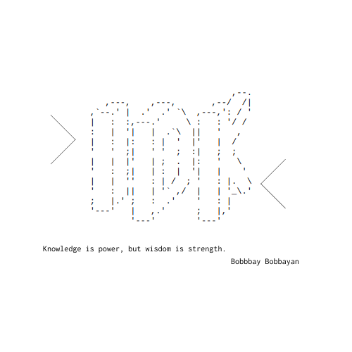

<p align="center">
  
</p>
<p align="center">
  <a href="#demo">Demo</a>
  &nbsp;&nbsp;&nbsp;|&nbsp;&nbsp;&nbsp;
  <a href="#install">Install</a>
  &nbsp;&nbsp;&nbsp;|&nbsp;&nbsp;&nbsp;
  <a href="#use">Use</a>
  &nbsp;&nbsp;&nbsp;|&nbsp;&nbsp;&nbsp;
  <a href="#options">Todo</a>
  &nbsp;&nbsp;&nbsp;|&nbsp;&nbsp;&nbsp;
  <a href="#contribute">Contribute</a>
</p>

## Description
I literally don't know.

```
“Quotation, n: The act of repeating erroneously the words of another.”
```

## Demo 
Under construction...

## Install
```
npm i -g bobbbay-idk
```

## Use
```
idk
```

## Options
```
idk -a [author]
```

## Uninstall
```
npm uninstall -g bobbbay-idk
```

## Contribute
JUST HELP US!
